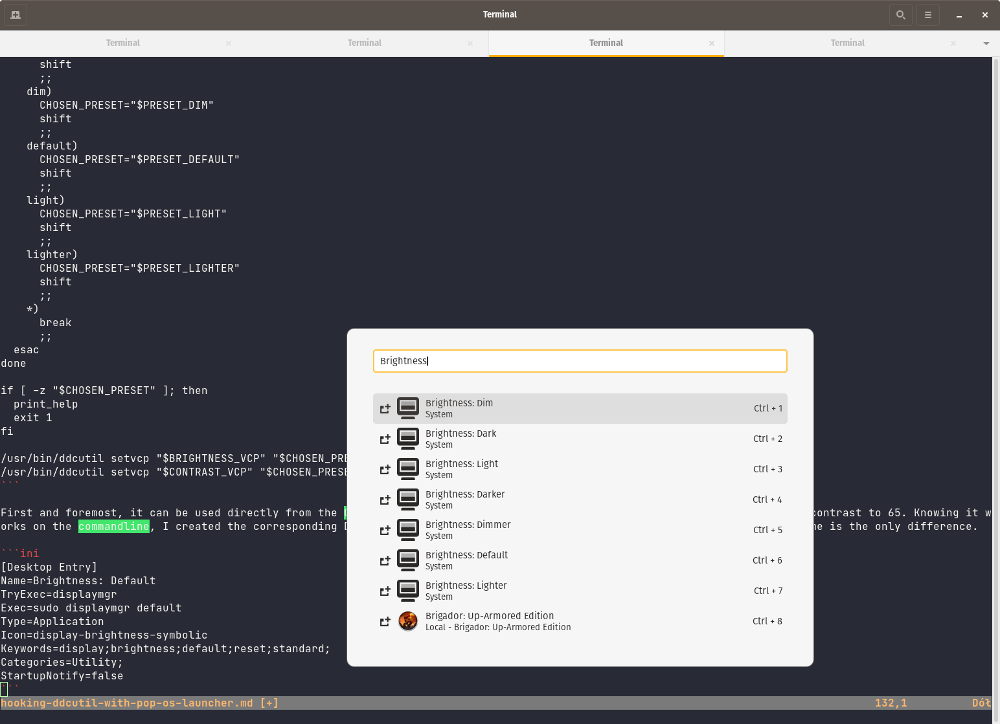

[//]: # (TITLE: Changing your display's brightness using the system launcher)
[//]: # (DESCRIPTION: Using application launcher to control the brightness and contrast of my screen)
[//]: # (DATE: 2021-10-03)
[//]: # (UPDATE DATE: 2023-01-11)

In the article [Controlling my screen using MCCS](#controlling-my-screen-using-mccs) I've shown how to use ddcutil to change both contrast and brightness of your monitor without touching its physical controls. Here, I want to show you how I got it hooked with Pop!_OS (or any DE, really) application launcher for ease of use.

Most Desktop Environments allow the user to quickly launch an application by showing a launcher. Whether it's something similiar to macOS's Spotlight, or Windows's Menu Start, it will allow you to launch a new application with just a few keystrokes.

On Linux, as many of you probably already know, the entries shown by that launcher are stored in one of the directories listed in `$XDG_DATA_DIRS` as defined by the [XDG Desktop Entry specification](https://specifications.freedesktop.org/desktop-entry-spec/desktop-entry-spec-latest.html). Each of these directories contain files with `.desktop` extension. If you'd open one of them, you'd find the content is something like this:

```ini
[Desktop Entry]
Version=1.0
Name=Firefox Web Browser
Comment=Browse the World Wide Web
GenericName=Web Browser
Keywords=Internet;WWW;Browser;Web;Explorer
Exec=firefox %u
Terminal=false
X-MultipleArgs=false
Type=Application
Icon=firefox
Categories=GNOME;GTK;Network;WebBrowser;
MimeType=text/html;text/xml;application/xhtml+xml;application/xml;application/rss+xml;application/rdf+xml;image/gif;image/jpeg;image/png;x-scheme-handler/http;x-scheme-handler/https;x-scheme-handler/ftp;x-scheme-handler/chrome;video/webm;application/x-xpinstall;
StartupNotify=true
Actions=new-window;new-private-window;

[Desktop Action new-window]
Name=Open a New Window
Exec=firefox -new-window

[Desktop Action new-private-window]
Name=Open a New Private Window
Exec=firefox -private-window
```

All of the above is nothing else but a specification to what should happen, when the XDG compliant program tries to analyze one of these files. It'll find fields like name, keywords, the path to the binary/command string or an icon.

My idea was to create a Desktop file for each of the brightness and contrast levels I wanted my monitor to be set to. I've decided to keep these two properties set to the same level, because that's how I got the best results in my case, although YMMV. In my case, given both properties are ranged from 0 to 100, the following levels were setup: Darker (40), Dark (45), Dimmer (50), Dim (57), Default (65), Light (70), Lighter (80). The number of levels and the values are the result of day to day usage. Initially started with three or four, but found out that they didn't fit well enough on some days as the screen was either too bright or too dim.

I also decided I don't want to keep these values in Desktop files directly. Over the years, I've found the hard way that keeping these kinds of settings outside of my VCS backed configuration is a bad idea. That's how I created this little utility called `displaymgr` which is nothing else but a simple shell script.

```bash
#!/usr/bin/env bash

if [ "$EUID" -ne 0 ]; then
  echo "Please run with elevated privileges."
  exit 1
fi

PACKAGE=$(basename "$0")

function print_help() {
  echo "Usage: ./$PACKAGE <preset>"
  echo "A small utility that allows to control the display supporting MCCS procotol."
  echo
  echo "Arguments:"
  echo "  preset              Can be darker, dark, dimmer, dim, default, light or lighter."
}

BRIGHTNESS_VCP=10
CONTRAST_VCP=12

PRESET_DARKER=40
PRESET_DARK=45
PRESET_DIMMER=50
PRESET_DIM=57
PRESET_DEFAULT=65
PRESET_LIGHT=75
PRESET_LIGHTER=80

CHOSEN_PRESET=

while test $# -gt 0; do
  case "$1" in
    darker)
      CHOSEN_PRESET="$PRESET_DARKER"
      shift
      ;;
    dark)
      CHOSEN_PRESET="$PRESET_DARK"
      shift
      ;;
    dimmer)
      CHOSEN_PRESET="$PRESET_DIMMER"
      shift
      ;;
    dim)
      CHOSEN_PRESET="$PRESET_DIM"
      shift
      ;;
    default)
      CHOSEN_PRESET="$PRESET_DEFAULT"
      shift
      ;;
    light)
      CHOSEN_PRESET="$PRESET_LIGHT"
      shift
      ;;
    lighter)
      CHOSEN_PRESET="$PRESET_LIGHTER"
      shift
      ;;
    *)
      break
      ;;
  esac
done

if [ -z "$CHOSEN_PRESET" ]; then
  print_help
  exit 1
fi

/usr/bin/ddcutil setvcp "$BRIGHTNESS_VCP" "$CHOSEN_PRESET"
/usr/bin/ddcutil setvcp "$CONTRAST_VCP" "$CHOSEN_PRESET"
```

First and foremost, it can be used directly from the CLI. Invoking `$ sudo displaymgr default` will set my monitor's brightness and contrast to 66. Knowing it works on the commandline, I created the corresponding Desktop files. All of them share the same structure, while the preset name is the only difference.

```ini
[Desktop Entry]
Name=Brightness: Default
TryExec=displaymgr
Exec=sudo displaymgr default
Type=Application
Icon=display-brightness-symbolic
Keywords=display;brightness;default;reset;standard;
Categories=Utility;
StartupNotify=false
```

The last remaining thing is to make the displaymgr runnable without providing the password. To do that, execute `$ sudo visudo /etc/sudoers.d/displaymgr` and save it with the following content: `ALL ALL = NOPASSWD:/usr/bin/displaymgr`.

With all of that done, I was now able to control the brightness and contrast of my monitor just as easily as launching an application.


