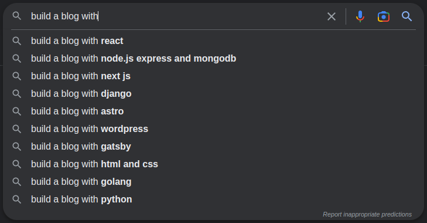

[//]: # (TITLE: This blog is handmade)
[//]: # (DESCRIPTION: Building a blog using simple tools.)
[//]: # (DATE: 2023-01-28)
[//]: # (UPDATE DATE: 2023-07-25)
[//]: # (TAGS: php, blog, handmade, diy)

This blog is handmade. I mean, of course, it is, right? Well, it depends on how you define "handmade".
For me, it means this blog is built using a set of readily available technologies and doesn't require me to install anything that isn't included in my distro's repositories.

Over the years I had a few failed attempts with blogging - I've tried blogger, wordpress.com, tumblr, hugo, jekyll and a few others. Nothing has stuck with me and while none of these solutions were the fault of my lack of enthusiasm, they didn't feel like anything I'd want to use for an extended period. Mostly, I felt they were way too complex for what I wanted to do - ramble about stuff without worrying about security, complex themes, or configurations. I didn't need any of it - instead, I wanted a simple solution that would gather the stuff I've written, repackage it and lay it out in some nice way. Years have passed, and trends have changed, but my requirements didn't budge - I still wanted the same thing.



At some point, two years ago, I convinced myself to give blogging another try. This time though, I wanted nothing to do with these big blogging platforms or extensible static site generators. I decided to implement something myself. What were my requirements? I knew that each article needed to be defined by a title, description, publication date, and optional modification date. How did I do that, given I wanted to have just a single file per article and it had to be a markdown file? I decided to utilize the reference-style links supported by most of the available Markdown converters - they have the following syntax: `[id]: url "title"`. The trick was to use an identifier that isn't referenced anywhere and the shortest, valid URL. The title would be used to store any data I wanted, while the whole line would be ignored by the converter. In the end, I came up with the following structure:

```markdown
[//]: # (TITLE: First Article)
[//]: # (DESCRIPTION: My first article about starting up this beautiful blogging journey!)
[//]: # (DATE: 2019-07-31)
[//]: # (UPDATE DATE: 2019-08-11)
```

Okay, at this point I had a method that allowed me to write articles and attach additional metadata. I decided to focus on templating as the next step. Most of the time, I'm programming in PHP using various frameworks. This time, I decided to take its templating capabilities for a spin and use it to generate some static content. I didn't want to overcomplicate this thing, so I utilized the [output buffering](https://www.php.net/manual/en/book.outcontrol.php) and the [extract](https://www.php.net/manual/en/function.extract) function. It's a very simple pattern that lets you set up the template's scope and capture the rendered template that normally would be sent back to the client or printed in a console. This method is not secure and doesn't let you cache anything or prevent the global variables from being leaked into the template, but fortunately, I didn't have to care about any of that! The rendering would be happening locally, I'd be the only person writing articles, and the whole thing would never be connected to a web server.

```php
function render_to_string(string $template_path, array $content = []): string
{
    extract($content);

    ob_start();
    include $template_path;
    return ob_get_clean();
}
```

What about the actual templates, though? As I said, it's been covered by PHP itself. Here's the template responsible for rendering the list of articles, one of which is the one you're currently reading. Something that normally requires third-party templating engines in other technologies, is handled natively by PHP. Nice!

One thing to note, though: despite its simplicity, we can't forget about escaping the output. Without it, any of the printed values can break the resulting document. Thanks to that one kind Reddit user that reminded me about that tiny-but-oh-so-important detail.

```php
function e(string $value): string
{
    return htmlspecialchars($value, ENT_QUOTES);
}
```

```php
<nav id="articles">
    <?php foreach($articles as $index => $article): ?>
    <div class="article-link">
        <span class="article-link__date"><?= e($article->creation_date->format('d/m/Y')) ?></span>

        <a href="<?= e($article->url) ?>">
            <?= e($article->title) ?>
        </a>
    </div>
    <?php endforeach; ?>
</nav>
```

I followed the same approach while implementing the RSS support. Given that RSS is nothing else but a `application/rss+xml` link in the head section of a page and an XML document listing the articles, adding support for this format was equally trivial. Here's the whole template that generates [the RSS feed](/feed.xml).

```php
<?xml version="1.0" ?>
<rss version="2.0">
    <channel>
        <title><?= e($site_title) ?></title>
        <link><?= e($site_url) ?></link>
        <description><?= e($site_description) ?></description>

        <?php foreach($articles as $article): ?>
           <item>
               <title><?= e($article->title) ?></title>
               <description><?= e($article->description) ?></description>
               <link><?= e($article->url) ?></link>
           </item>
       <?php endforeach; ?>
   </channel>
</rss>
```


As for converting the articles into HTML, I decided to use [pandoc](https://pandoc.org/), a swiss-army knife when it comes to converting documents between formats. Here's the neat part, though. Did you know that pandoc can also syntax highlight code blocks? It utilizes the [skylighting](https://github.com/jgm/skylighting) to parse and tag the source code. The result is a build-time highlighted code block, styleable using CSS. I opted for the monochrome theme that uses font weight, instead of colors, to highlight the code. Works great!

Aside from the above, the rest is handled by the build script. It's concatenating the stylesheets for inlining, parsing metadata, calling pandoc with each article to generate the HTML, copying over the images used in articles, and generating header identifiers that allow each article to be linked to. It also makes sure the CNAME file is present as this blog is hosted on GitHub pages with a custom domain.

That's it! That's how this whole thing works. It's nothing advanced, but I'm proud I've managed to find a solution that's bound to reliable software and doesn't require a whole toolchain to execute. If you want to see the whole picture, [the source code for this blog](https://github.com/d1823/blog) is public - feel free to check it out. It's heavily commented and easy to follow.
